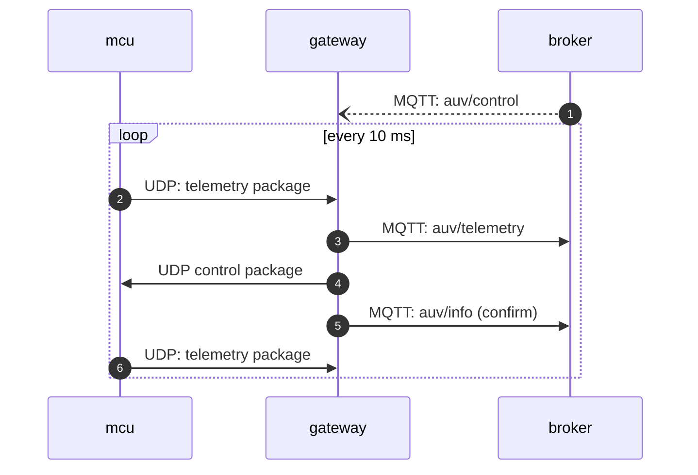
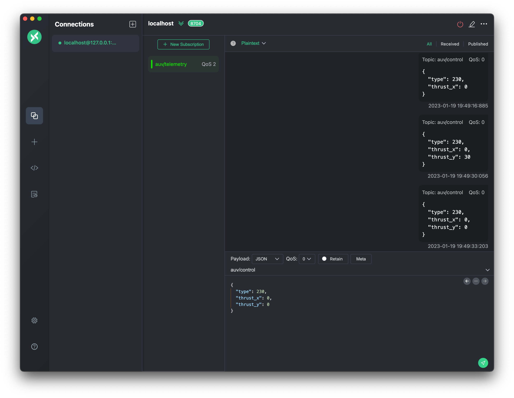
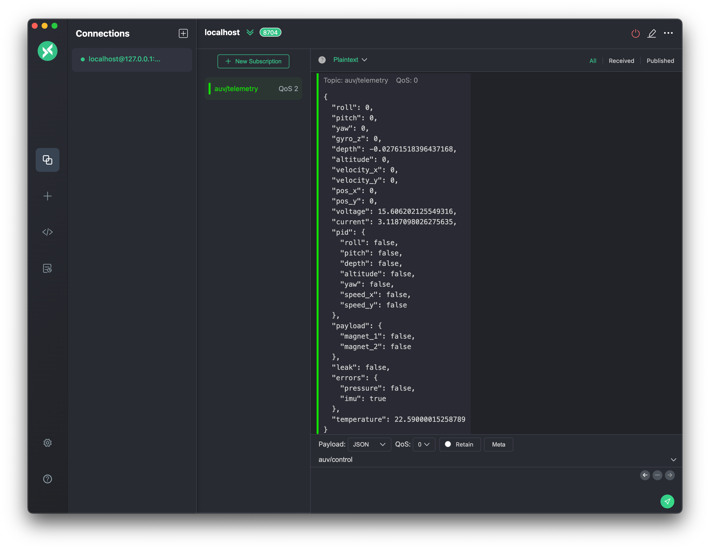

# MSUR Gateway
В базовой реализации управление аппаратом происходит в `синхронном режиме`,
в цикле с частотой 10Hz, для высокоуровневого управления удобнее схема
`событийного управления`. Gateway является прослойкой обеспечивающей событийное
управление и абстрагирует нас от синхронного протокола аппарата.


# Запуск
Для запуска необходимо собрать `docker` контейнер следующей командой:

```shell
docker build -t msur-gateway .
```
после сборки вы можете запустить контейнер следующей командой:
```shell
docker run -d --rm -e MQTT_BROKER=amqp://172.17.0.1:1883 -p 2065:2065 --name msur-gateway msur-gateway
```
## Параметры запуска

| Переменная    | Описание                                              | Пример                 |
|---------------|-------------------------------------------------------|------------------------|
| `MQTT_BROKER` | Адрес сервера MQTT                                    | amqp://172.17.0.1:1883 |
| `AUV_TOPIK`   | Базовый топик в который будет писать Gateway          | my/auv                 |
| `HOST_PORT`   | Порт на который принимается UDP телеметрия с аппарата | 2065                   |


# Управление аппаратом
Для управления аппаратом необходимо отправить `JSON` согласно структуре
`пакета управления` в соответствующий топик `AUV_TOPIK/control`



# Телеметрия
С аппарата в режиме реального времени передается телеметрия, она публикуется
в соответствующий топик `AUV_TOPIK/telemetry`



<details><summary>Структура пакета управления</summary>
<p>

```json
{
  "thrust_y": 0, 
  "thrust_x": 0, 
  "thrust_w": 0, 
  "thrust_z": 0, 
  "depth": 0, 
  "altitude": 0, 
  "yaw": 0, 
  "velocity_x": 0, 
  "velocity_y": 0, 
  "pid": {
    "updated": false, 
    "status": {
      "roll": false, 
      "pitch": false, 
      "depth": false, 
      "altitude": false, 
      "yaw": false, 
      "speed_x": false, 
      "speed_y": false
    },
    "settings": [
      {
        "type": 110, 
        "p": 1.0, 
        "i": 1.0, 
        "d": 1.0
      },
      {
        "type": 111, 
        "p": 1.0
      }
    ], 
    "saved": true
  },
  "payload": {
    "magnet_1": false,
    "magnet_2": false
  },
  "navigation": false
}

```
</p>
</details>

# Состояние аппарата
Для описания состояния аппарата используется объект со следующей структурой:
<details><summary>Структура пакета управления</summary>
<p>

```json
{
    "title": "AUV",
    "description": "Виртуальный AUV",
    "type": "object",
    "properties": {
        "thrust_y": {
            "title": "Тяга по Y",
            "default": 0,
            "minimum": 0,
            "maximum": 100,
            "type": "integer"
        },
        "thrust_x": {
            "title": "Тяга по X",
            "default": 0,
            "minimum": 0,
            "maximum": 100,
            "type": "integer"
        },
        "thrust_w": {
            "title": "Тяга по W",
            "default": 0,
            "minimum": 0,
            "maximum": 100,
            "type": "integer"
        },
        "thrust_z": {
            "title": "Тяга по Z",
            "default": 0,
            "minimum": 0,
            "maximum": 100,
            "type": "integer"
        },
        "depth": {
            "title": "Уставка по глубине",
            "description": "Задается в метрах",
            "default": 0,
            "type": "number"
        },
        "altitude": {
            "title": "Уставка по высоте",
            "description": "Задается в метрах",
            "default": 0,
            "type": "number"
        },
        "yaw": {
            "title": "Уставка по курсу",
            "description": "Задается в градусах",
            "default": 0,
            "type": "number"
        },
        "velocity_x": {
            "title": "Скорость по X",
            "default": 0,
            "type": "number"
        },
        "velocity_y": {
            "title": "Скорость по Y",
            "default": 0,
            "type": "number"
        },
        "pid": {
            "title": "Pid",
            "default": {
                "status": {
                    "roll": false,
                    "pitch": false,
                    "depth": false,
                    "altitude": false,
                    "yaw": false,
                    "speed_x": false,
                    "speed_y": false
                },
                "settings": [],
                "saved": true
            },
            "allOf": [{"$ref": "#/definitions/PidConfig"}]
        },
        "payload": {
            "title": "Payload",
            "default": {"magnet_1": false, "magnet_2": false},
            "allOf": [{"$ref": "#/definitions/Payload"}]
        },
        "navigation": {
            "title": "Отсчет локальной системы координат",
            "description": "Вкл/выкл локальную систему координат",
            "default": false,
            "type": "boolean"
        }
    },
    "definitions": {
        "PidStatus": {
            "title": "PidStatus",
            "description": "Состояние регуляторов",
            "type": "object",
            "properties": {
                "roll": {
                    "title": "Состояние регулятора крена",
                    "description": "Вкл/выкл регулятор",
                    "default": false,
                    "type": "boolean"
                },
                "pitch": {
                    "title": "Состояние регулятора дифферента",
                    "description": "Вкл/выкл регулятор",
                    "default": false,
                    "type": "boolean"
                },
                "depth": {
                    "title": "Состояние регулятора глубины",
                    "description": "Вкл/выкл регулятор",
                    "default": false,
                    "type": "boolean"
                },
                "altitude": {
                    "title": "Состояние регулятора высоты",
                    "description": "Вкл/выкл регулятор",
                    "default": false,
                    "type": "boolean"
                },
                "yaw": {
                    "title": "Состояние регулятора курса",
                    "description": "Вкл/выкл регулятор",
                    "default": false,
                    "type": "boolean"
                },
                "speed_x": {
                    "title": "Состояние регулятора скорости по Х",
                    "description": "Вкл/выкл регулятор",
                    "default": false,
                    "type": "boolean"
                },
                "speed_y": {
                    "title": "Состояние регулятора ",
                    "description": "Вкл/выкл регулятор",
                    "default": false,
                    "type": "boolean"
                }
            }
        },
        "PidType": {
            "title": "PidType",
            "description": "An enumeration.",
            "enum": [110, 111, 112, 113, 114, 115, 116, 117],
            "type": "integer"
        },
        "PidSettings": {
            "title": "PidSettings",
            "description": "Настройка регулятора",
            "type": "object",
            "properties": {
                "type": {"$ref": "#/definitions/PidType"},
                "p": {
                    "title": "Пропорциональная составляющая",
                    "type": "number"
                },
                "i": {"title": "Интегральная составляющая", "type": "number"},
                "d": {
                    "title": "Дифференциальная составляющая",
                    "type": "number"
                }
            },
            "required": ["type", "p", "i", "d"]
        },
        "PidConfig": {
            "title": "PidConfig",
            "description": "Конфигурация системы ПИД регуляторов, состояние и  конфигурация",
            "type": "object",
            "properties": {
                "status": {
                    "title": "Status",
                    "default": {
                        "roll": false,
                        "pitch": false,
                        "depth": false,
                        "altitude": false,
                        "yaw": false,
                        "speed_x": false,
                        "speed_y": false
                    },
                    "allOf": [{"$ref": "#/definitions/PidStatus"}]
                },
                "settings": {
                    "title": "Settings",
                    "default": [],
                    "type": "array",
                    "items": {"$ref": "#/definitions/PidSettings"},
                    "uniqueItems": true
                },
                "saved": {
                    "title": "Состояние настроек ПИД регуляторов",
                    "description": "Сохранена ли текущая конфигурация",
                    "default": true,
                    "type": "boolean"
                }
            }
        },
        "Payload": {
            "title": "Payload",
            "description": "Состояние полезной нагрузки",
            "type": "object",
            "properties": {
                "magnet_1": {
                    "title": "Полезная нагрузка 1",
                    "description": "Вкл/выкл полезную нагрузку 1",
                    "default": false,
                    "type": "boolean"
                },
                "magnet_2": {
                    "title": "Полезная нагрузка 2",
                    "description": "Вкл/выкл полезную нагрузку 2",
                    "default": false,
                    "type": "boolean"
                }
            }
        }
    }
}

```
</p>
</details>

с помощью пакета управления вы можете изменять атрибуты этого объекта, эта 
структура используется для поддержания цикла взаимодействия с `mcu`
